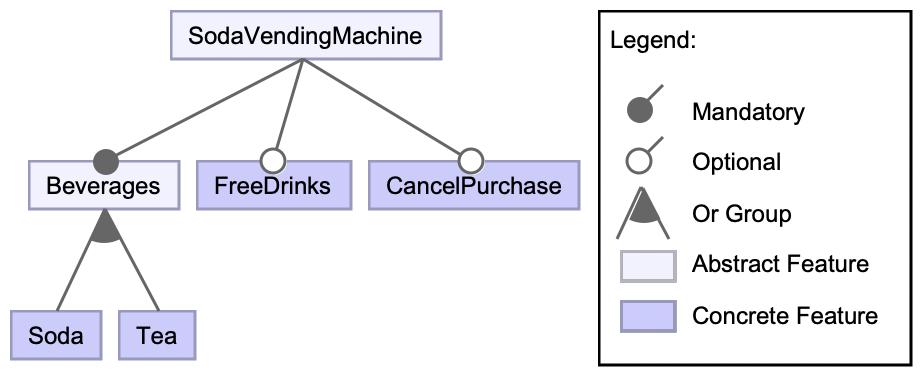
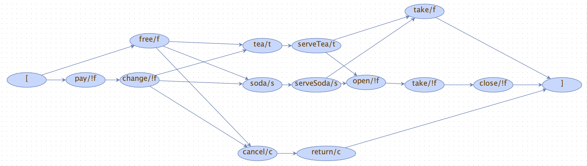
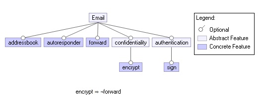
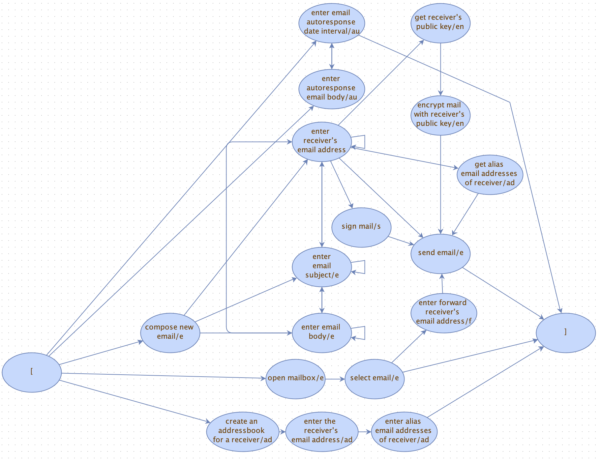
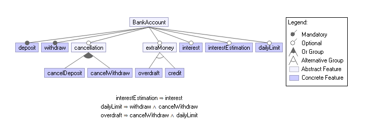
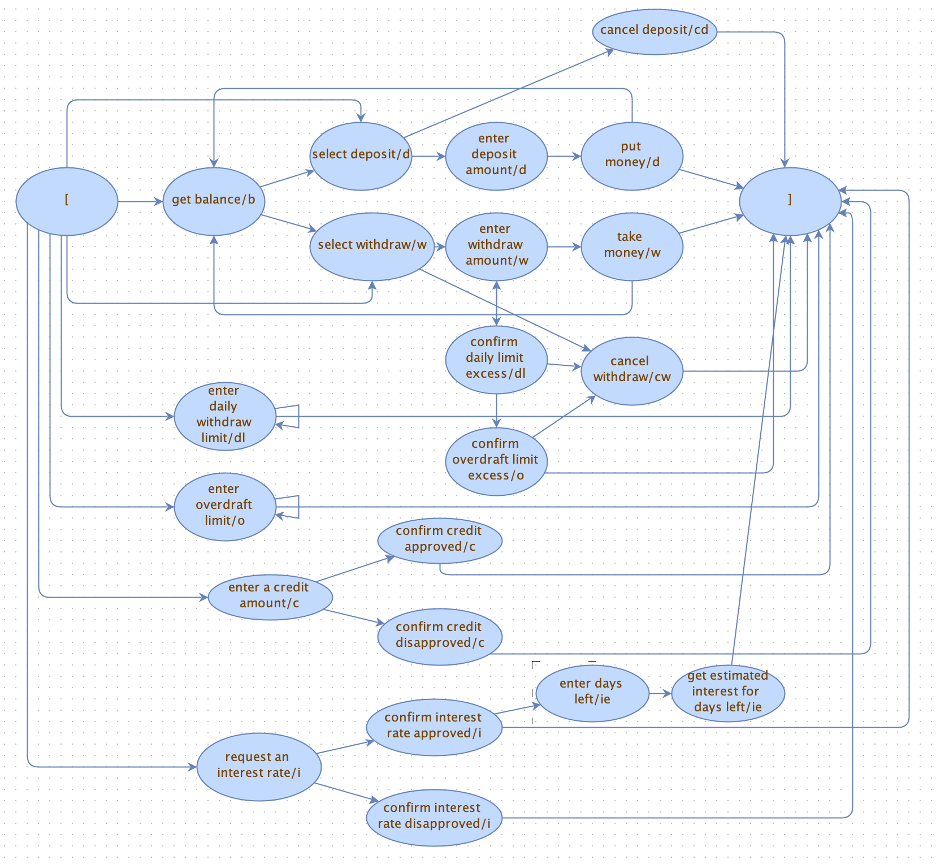

# esg-with-feature-expressions

## How to use esg-with-feature-expressions in Eclipse IDE

Clone esg-with-feature-expressions project. 
Open Eclipse IDE. 
Follow File -> Import -> Maven -> Existing Maven Projects and select the cloned project. 

## Experiment Results

# Soda Vending Machine SPL

The feature model of the Soda Vending Machine SPL is given below. There are 4 features and 12 product configurations.  The vending machine, in its simplest form, accepts a coin, provides change, serves beverages, and eventually unlocks a compartment for the customer to retrieve their soda, after which it closes the compartment once more. 

The ESG-Fx model of the Soda Vending Machine SPL is given below. There are 15 vertices and 21 edges in this model. 

The experiment results of SVM SPL are given below. The test sequences of each product configuration are generated. 

| SVM | Features                | Number of Features | Test Sequences                                                                                                                              | Event Coverage Percentage | Test Sequence Generation Time (ms) |
| --- | ----------------------- | ------------------ | ------------------------------------------------------------------------------------------------------------------------------------------- | ------------------------- | ---------------------------------- |
| P1  | soda                    | 1                  | 7 : pay, change, soda, serveSoda, open, take, close                                                                                         | 100%                      | 15,53                              |
| P2  | tea                     | 1                  | 7 : pay, change, tea, serveTea, open, take, close                                                                                           | 100%                      | 14,83                              |
| P3  | soda, tea               | 2                  | 7 : pay, change, soda, serveSoda, open, take, close 7 : pay, change, tea, serveTea, open, take, close                                    | 100%                      | 16,67                              |
| P4  | soda, free              | 2                  | 4 : free, soda, serveSoda, take                                                                                                             | 100%                      | 14,67                              |
| P5  | tea, free               | 2                  | 4 : free, tea, serveTea, take                                                                                                               | 100%                      | 15,37                              |
| P6  | soda, cancel            | 2                  | 7 : pay, change, soda, serveSoda, open, take, close 4 : pay, change, cancel, return                                                      | 100%                      | 15,43                              |
| P7  | tea, cancel             | 2                  | 7 : pay, change, tea, serveTea, open, take, close 4 : pay, change, cancel, return                                                        | 100%                      | 15,36                              |
| P8  | soda, tea, cancel       | 3                  | 7 : pay, change, soda, serveSoda, open, take, close 7 : pay, change, tea, serveTea, open, take, close 4 : pay, change, cancel, return | 100%                      | 17,98                              |
| P9  | soda, free, cancel      | 3                  | 4 : free, soda, serveSoda, take 3 : free, cancel, return                                                                                 | 100%                      | 15,18                              |
| P10 | tea, free, cancel       | 3                  | 4 : free, tea, serveTea, take 3 : free, cancel, return                                                                                   | 100%                      | 15,74                              |
| P11 | soda, tea, free         | 3                  | 4 : free, soda, serveSoda, take 4 : free, tea, serveTea, take                                                                            | 100%                      | 15,39                              |
| P12 | soda, tea, free, cancel | 4                  | 7 : pay, change, soda, serveSoda, open, take, close 4 : free, tea, serveTea, take 3 : free, cancel, return                            | 100%                      | 14,86                              |
|     |                         |                    |                                                                                                                                             |                           | **15,58**                              |
[Click for downloading the PDF version of the table](ExperimentResults/SVM_ExperimentResults.pdf)

# e-Mail SPL

The feature model of the e-Mail SPL is given below. There are 5 features.  e-Mail SPL is a product line of email clients that offers the feature _addressbook_ for creating an addressbook of email contacts, _autoresponder_ for autoresponding incoming emails between a specified date interval, _forward_ for forwarding incoming emails, _encrypt_ for encrypting outgoing emails and, _sign_ or signing outgoing emails. A basic e-Mail client provides events for composing a new email and for reading an incoming email.

The ESG-Fx model of the e-Mail SPL is given below. There are 19 vertices and 35 edges in this model. 

The experiment results of e-Mail SPL are given below. The test sequences of each product configuration are generated. 

| eM  | Features                                  | Number of Features | Test Sequences                                                                                                                                                                                                                                                                                                                                                                                                                                                                                                                                                                                                                                                                                                                                                                                                         | Event Coverage Percentage | Test Sequence Generation Time (ms) |
| --- | ----------------------------------------- | ------------------ | ---------------------------------------------------------------------------------------------------------------------------------------------------------------------------------------------------------------------------------------------------------------------------------------------------------------------------------------------------------------------------------------------------------------------------------------------------------------------------------------------------------------------------------------------------------------------------------------------------------------------------------------------------------------------------------------------------------------------------------------------------------------------------------------------------------------------- | ------------------------- | ---------------------------------- |
| P0  | \-                                        | 0                  | 9 : compose_new_email, enter_receiver's_email_address, enter_email_subject, enter_email_body, enter_email_body, enter_email_body, enter_email_subject, enter_receiver's_email_address, send_email 2 : open_mailbox, select_email                                                                                                                                                                                                                                                                                                                                                                                                                                                                                                                                                                                    | 100%                      | 17,97                              |
| P1  | addressbook                               | 1                  | 9 : compose_new_email, enter_receiver's_email_address, enter_email_subject, enter_email_body, enter_email_body, enter_email_body, enter_email_subject, enter_receiver's_email_address, send_email 2 : open_mailbox, select_email 3 : create_an_addressbook_for_a_receiver, enter_the_receiver's_email_address, enter_alias_email_addresses_of_receiver 4 : compose_new_email, enter_receiver's_email_address, get_alias_email_addresses_of_receiver, send_email                                                                                                                                                                                                                                                                                                                                               | 100%                      | 18,84                              |
| P2  | autoresponder                             | 1                  | 9 : compose_new_email, enter_receiver's_email_address, enter_email_subject, enter_email_body, enter_email_body, enter_email_body, enter_email_subject, enter_receiver's_email_address, send_email 2 : open_mailbox, select_email 3 : enter_email_autoresponse_date_interval, enter_autoresponse_email_body, enter_email_autoresponse_date_interval                                                                                                                                                                                                                                                                                                                                                                                                                                                               | 100%                      | 18,72                              |
| P4  | forward                                   | 1                  | 9 : compose_new_email, enter_receiver's_email_address, enter_email_subject, enter_email_body, enter_email_body, enter_email_body, enter_email_subject, enter_receiver's_email_address, send_email 2 : open_mailbox, select_email 4 : open_mailbox, select_email, enter_forward_receiver's_email_address, send_email                                                                                                                                                                                                                                                                                                                                                                                                                                                                                              | 100%                      | 18,80                              |
| P8  | encrypt                                   | 1                  | 9 : compose_new_email, enter_receiver's_email_address, enter_email_subject, enter_email_body, enter_email_body, enter_email_body, enter_email_subject, enter_receiver's_email_address, send_email 2 : open_mailbox, select_email 5 : compose_new_email, enter_receiver's_email_address, get_receiver's_public_key, encrypt_mail_with_receiver's_public_key, send_email                                                                                                                                                                                                                                                                                                                                                                                                                                           | 100%                      | 19,17                              |
| P12 | sign                                      | 1                  | 9 : compose_new_email, enter_receiver's_email_address, enter_email_subject, enter_email_body, enter_email_body, enter_email_body, enter_email_subject, enter_receiver's_email_address, send_email 2 : open_mailbox, select_email 4 : compose_new_email, enter_receiver's_email_address, sign_mail, send_email                                                                                                                                                                                                                                                                                                                                                                                                                                                                                                    | 100%                      | 19,64                              |
| P3  | addressbook, autoresponder                | 2                  | 9 : compose_new_email, enter_receiver's_email_address, enter_email_subject, enter_email_body, enter_email_body, enter_email_body, enter_email_subject, enter_receiver's_email_address, send_email 2 : open_mailbox, select_email 3 : enter_email_autoresponse_date_interval, enter_autoresponse_email_body, enter_email_autoresponse_date_interval 3 : create_an_addressbook_for_a_receiver, enter_the_receiver's_email_address, enter_alias_email_addresses_of_receiver 4 : compose_new_email, enter_receiver's_email_address, get_alias_email_addresses_of_receiver, send_email                                                                                                                                                                                                                          | 100%                      | 19,30                              |
| P5  | addressbook, forward                      | 2                  | 9 : compose_new_email, enter_receiver's_email_address, enter_email_subject, enter_email_body, enter_email_body, enter_email_body, enter_email_subject, enter_receiver's_email_address, send_email 2 : open_mailbox, select_email 3 : create_an_addressbook_for_a_receiver, enter_the_receiver's_email_address, enter_alias_email_addresses_of_receiver 4 : open_mailbox, select_email, enter_forward_receiver's_email_address, send_email 4 : compose_new_email, enter_receiver's_email_address, get_alias_email_addresses_of_receiver, send_email                                                                                                                                                                                                                                                         | 100%                      | 20,28                              |
| P6  | autoresponder, forward                    | 2                  | 9 : compose_new_email, enter_receiver's_email_address, enter_email_subject, enter_email_body, enter_email_body, enter_email_body, enter_email_subject, enter_receiver's_email_address, send_email 2 : open_mailbox, select_email 3 : enter_email_autoresponse_date_interval, enter_autoresponse_email_body, enter_email_autoresponse_date_interval 4 : open_mailbox, select_email, enter_forward_receiver's_email_address, send_email                                                                                                                                                                                                                                                                                                                                                                         | 100%                      | 19,48                              |
| P9  | addressbook, encrypt                      | 2                  | 9 : compose_new_email, enter_receiver's_email_address, enter_email_subject, enter_email_body, enter_email_body, enter_email_body, enter_email_subject, enter_receiver's_email_address, send_email 2 : open_mailbox, select_email 3 : create_an_addressbook_for_a_receiver, enter_the_receiver's_email_address, enter_alias_email_addresses_of_receiver 4 : compose_new_email, enter_receiver's_email_address, get_alias_email_addresses_of_receiver, send_email 5 : compose_new_email, enter_receiver's_email_address, get_receiver's_public_key, encrypt_mail_with_receiver's_public_key, send_email                                                                                                                                                                                                      | 100%                      | 20,15                              |
| P10 | autoresponder, encrypt                    | 2                  | 9 : compose_new_email, enter_receiver's_email_address, enter_email_subject, enter_email_body, enter_email_body, enter_email_body, enter_email_subject, enter_receiver's_email_address, send_email 2 : open_mailbox, select_email 3 : enter_email_autoresponse_date_interval, enter_autoresponse_email_body, enter_email_autoresponse_date_interval 5 : compose_new_email, enter_receiver's_email_address, get_receiver's_public_key, encrypt_mail_with_receiver's_public_key, send_email                                                                                                                                                                                                                                                                                                                      | 100%                      | 19,52                              |
| P13 | addressbook, sign                         | 2                  | 9 : compose_new_email, enter_receiver's_email_address, enter_email_subject, enter_email_body, enter_email_body, enter_email_body, enter_email_subject, enter_receiver's_email_address, send_email 2 : open_mailbox, select_email 3 : create_an_addressbook_for_a_receiver, enter_the_receiver's_email_address, enter_alias_email_addresses_of_receiver 4 : compose_new_email, enter_receiver's_email_address, get_alias_email_addresses_of_receiver, send_email 4 : compose_new_email, enter_receiver's_email_address, sign_mail, send_email                                                                                                                                                                                                                                                               | 100%                      | 21,17                              |
| P14 | autoresponder, sign                       | 2                  | 9 : compose_new_email, enter_receiver's_email_address, enter_email_subject, enter_email_body, enter_email_body, enter_email_body, enter_email_subject, enter_receiver's_email_address, send_email 2 : open_mailbox, select_email 3 : enter_email_autoresponse_date_interval, enter_autoresponse_email_body, enter_email_autoresponse_date_interval 4 : compose_new_email, enter_receiver's_email_address, sign_mail, send_email                                                                                                                                                                                                                                                                                                                                                                               | 100%                      | 19,09                              |
| P16 | forward, sign                             | 2                  | 9 : compose_new_email, enter_receiver's_email_address, enter_email_subject, enter_email_body, enter_email_body, enter_email_body, enter_email_subject, enter_receiver's_email_address, send_email 2 : open_mailbox, select_email 4 : open_mailbox, select_email, enter_forward_receiver's_email_address, send_email 4 : compose_new_email, enter_receiver's_email_address, sign_mail, send_email                                                                                                                                                                                                                                                                                                                                                                                                              | 100%                      | 21,18                              |
| P20 | encrypt, sign                             | 2                  | 9 : compose_new_email, enter_receiver's_email_address, enter_email_subject, enter_email_body, enter_email_body, enter_email_body, enter_email_subject, enter_receiver's_email_address, send_email 2 : open_mailbox, select_email 5 : compose_new_email, enter_receiver's_email_address, get_receiver's_public_key, encrypt_mail_with_receiver's_public_key, send_email 4 : compose_new_email, enter_receiver's_email_address, sign_mail, send_email                                                                                                                                                                                                                                                                                                                                                           | 100%                      | 19,86                              |
| P7  | addressbook, autoresponder, forward       | 3                  | 9 : compose_new_email, enter_receiver's_email_address, enter_email_subject, enter_email_body, enter_email_body, enter_email_body, enter_email_subject, enter_receiver's_email_address, send_email 2 : open_mailbox, select_email 3 : enter_email_autoresponse_date_interval, enter_autoresponse_email_body, enter_email_autoresponse_date_interval 3 : create_an_addressbook_for_a_receiver, enter_the_receiver's_email_address, enter_alias_email_addresses_of_receiver 4 : open_mailbox, select_email, enter_forward_receiver's_email_address, send_email 4 : compose_new_email, enter_receiver's_email_address, get_alias_email_addresses_of_receiver, send_email                                                                                                                                    | 100%                      | 20,80                              |
| P11 | addressbook, autoresponder, encrypt       | 3                  | 9 : compose_new_email, enter_receiver's_email_address, enter_email_subject, enter_email_body, enter_email_body, enter_email_body, enter_email_subject, enter_receiver's_email_address, send_email 2 : open_mailbox, select_email 3 : enter_email_autoresponse_date_interval, enter_autoresponse_email_body, enter_email_autoresponse_date_interval 3 : create_an_addressbook_for_a_receiver, enter_the_receiver's_email_address, enter_alias_email_addresses_of_receiver 4 : compose_new_email, enter_receiver's_email_address, get_alias_email_addresses_of_receiver, send_email 5 : compose_new_email, enter_receiver's_email_address, get_receiver's_public_key, encrypt_mail_with_receiver's_public_key, send_email                                                                                 | 100%                      | 21,22                              |
| P15 | addressbook, autoresponder, sign          | 3                  | 9 : compose_new_email, enter_receiver's_email_address, enter_email_subject, enter_email_body, enter_email_body, enter_email_body, enter_email_subject, enter_receiver's_email_address, send_email 2 : open_mailbox, select_email 3 : enter_email_autoresponse_date_interval, enter_autoresponse_email_body, enter_email_autoresponse_date_interval 3 : create_an_addressbook_for_a_receiver, enter_the_receiver's_email_address, enter_alias_email_addresses_of_receiver 4 : compose_new_email, enter_receiver's_email_address, get_alias_email_addresses_of_receiver, send_email 4 : compose_new_email, enter_receiver's_email_address, sign_mail, send_email                                                                                                                                          | 100%                      | 21,04                              |
| P17 | addressbook, forward, sign                | 3                  | 9 : compose_new_email, enter_receiver's_email_address, enter_email_subject, enter_email_body, enter_email_body, enter_email_body, enter_email_subject, enter_receiver's_email_address, send_email 2 : open_mailbox, select_email 3 : create_an_addressbook_for_a_receiver, enter_the_receiver's_email_address, enter_alias_email_addresses_of_receiver 4 : open_mailbox, select_email, enter_forward_receiver's_email_address, send_email 4 : compose_new_email, enter_receiver's_email_address, get_alias_email_addresses_of_receiver, send_email 4 : compose_new_email, enter_receiver's_email_address, sign_mail, send_email                                                                                                                                                                         | 100%                      | 21,12                              |
| P18 | autoresponder, forward, sign              | 3                  | 9 : compose_new_email, enter_receiver's_email_address, enter_email_subject, enter_email_body, enter_email_body, enter_email_body, enter_email_subject, enter_receiver's_email_address, send_email 2 : open_mailbox, select_email 3 : enter_email_autoresponse_date_interval, enter_autoresponse_email_body, enter_email_autoresponse_date_interval 4 : open_mailbox, select_email, enter_forward_receiver's_email_address, send_email 4 : compose_new_email, enter_receiver's_email_address, sign_mail, send_email                                                                                                                                                                                                                                                                                         | 100%                      | 20,70                              |
| P21 | addressbook, encrypt, sign                | 3                  | 9 : compose_new_email, enter_receiver's_email_address, enter_email_subject, enter_email_body, enter_email_body, enter_email_body, enter_email_subject, enter_receiver's_email_address, send_email 2 : open_mailbox, select_email 3 : create_an_addressbook_for_a_receiver, enter_the_receiver's_email_address, enter_alias_email_addresses_of_receiver 4 : compose_new_email, enter_receiver's_email_address, get_alias_email_addresses_of_receiver, send_email 5 : compose_new_email, enter_receiver's_email_address, get_receiver's_public_key, encrypt_mail_with_receiver's_public_key, send_email 4 : compose_new_email, enter_receiver's_email_address, sign_mail, send_email                                                                                                                      | 100%                      | 20,73                              |
| P22 | autoresponder, encrypt, sign              | 3                  | 9 : compose_new_email, enter_receiver's_email_address, enter_email_subject, enter_email_body, enter_email_body, enter_email_body, enter_email_subject, enter_receiver's_email_address, send_email 2 : open_mailbox, select_email 3 : enter_email_autoresponse_date_interval, enter_autoresponse_email_body, enter_email_autoresponse_date_interval 5 : compose_new_email, enter_receiver's_email_address, get_receiver's_public_key, encrypt_mail_with_receiver's_public_key, send_email 4 : compose_new_email, enter_receiver's_email_address, sign_mail, send_email                                                                                                                                                                                                                                      | 100%                      | 20,86                              |
| P19 | addressbook, autoresponder, forward, sign | 4                  | 9 : compose_new_email, enter_receiver's_email_address, enter_email_subject, enter_email_body, enter_email_body, enter_email_body, enter_email_subject, enter_receiver's_email_address, send_email 2 : open_mailbox, select_email 3 : enter_email_autoresponse_date_interval, enter_autoresponse_email_body, enter_email_autoresponse_date_interval 3 : create_an_addressbook_for_a_receiver, enter_the_receiver's_email_address, enter_alias_email_addresses_of_receiver 4 : open_mailbox, select_email, enter_forward_receiver's_email_address, send_email 4 : compose_new_email, enter_receiver's_email_address, get_alias_email_addresses_of_receiver, send_email 4 : compose_new_email, enter_receiver's_email_address, sign_mail, send_email                                                    | 100%                      | 20,87                              |
| P23 | addressbook, autoresponder, encrypt, sign | 4                  | 9 : compose_new_email, enter_receiver's_email_address, enter_email_subject, enter_email_body, enter_email_body, enter_email_body, enter_email_subject, enter_receiver's_email_address, send_email 2 : open_mailbox, select_email 3 : enter_email_autoresponse_date_interval, enter_autoresponse_email_body, enter_email_autoresponse_date_interval 3 : create_an_addressbook_for_a_receiver, enter_the_receiver's_email_address, enter_alias_email_addresses_of_receiver 4 : compose_new_email, enter_receiver's_email_address, get_alias_email_addresses_of_receiver, send_email 5 : compose_new_email, enter_receiver's_email_address, get_receiver's_public_key, encrypt_mail_with_receiver's_public_key, send_email 4 : compose_new_email, enter_receiver's_email_address, sign_mail, send_email | 100%                      | 21,18                              |
|     |                                           |                    |                                                                                                                                                                                                                                                                                                                                                                                                                                                                                                                                                                                                                                                                                                                                                                                                                        |                           | **20,07**                              |

[Click for downloading the PDF version of the table](ExperimentResults/eM_ExperimentResults.pdf)

# Bank Account SPL

The feature model of the Bank Account SPL is given below. There are 9 features.  Bank Account SPL is a product line of banking software that offers the_ _deposit_, _withdraw_, _cancelDeposit_ and, _cancelWithdraw_ features for money deposit, withdrawal, and cancellation of the deposit and withdrawal operations, respectively; the _overdraft_ feature for negative balance permission; the _credit_ feature for assessment of a customer credit request of a certain amount; the _interest_ and _interestEstimation_ features for calculation of the expected interest; the _dailyLimit_ feature for limitation of daily withdrawal. A basic Bank Account product provides the current balance.

The ESG-Fx model of the Bank Account SPL is given below. There are 23 vertices and 42 edges in this model. 

 The experiment results of Bank Account SPL are given below. The test sequences of each product configuration are generated.   

 | BA  | Features                                                                                              | Number of Features | Test Sequences                                                                                                                                                                                                                                                                                                                                                                                                                                                                                                                                                                                                                                                                                                                                                                                | Event Coverage Percentage | Test Sequence Generation Time (ms) |
| --- | ----------------------------------------------------------------------------------------------------- | ------------------ | --------------------------------------------------------------------------------------------------------------------------------------------------------------------------------------------------------------------------------------------------------------------------------------------------------------------------------------------------------------------------------------------------------------------------------------------------------------------------------------------------------------------------------------------------------------------------------------------------------------------------------------------------------------------------------------------------------------------------------------------------------------------------------------------- | ------------------------- | ---------------------------------- |
| P0  | deposit, withdraw                                                                                     | 2                  | 4 : get_balance, select_deposit, enter_deposit_amount, put_money 3 : select_withdraw, enter_withdraw_amount, take_money                                                                                                                                                                                                                                                                                                                                                                                                                                                                                                                                                                                                                                                                    | 100%                      | 18,25                              |
| P1  | deposit, withdraw, interest                                                                           | 3                  | 4 : get_balance, select_deposit, enter_deposit_amount, put_money 3 : select_withdraw, enter_withdraw_amount, take_money 2 : request_an_interest_rate, confirm_interest_rate_approved 2 : request_an_interest_rate, confirm_interest_rate_disapproved                                                                                                                                                                                                                                                                                                                                                                                                                                                                                                                                 | 100%                      | 18,53                              |
| P3  | deposit, withdraw, cancelDeposit                                                                      | 3                  | 4 : get_balance, select_deposit, enter_deposit_amount, put_money 3 : select_withdraw, enter_withdraw_amount, take_money 6 : select_withdraw, enter_withdraw_amount, take_money, get_balance, select_deposit, cancel_deposit                                                                                                                                                                                                                                                                                                                                                                                                                                                                                                                                                             | 100%                      | 21,11                              |
| P6  | deposit, withdraw, cancelWithdraw                                                                     | 3                  | 4 : get_balance, select_deposit, enter_deposit_amount, put_money 3 : select_withdraw, enter_withdraw_amount, take_money 2 : select_withdraw, cancel_withdraw                                                                                                                                                                                                                                                                                                                                                                                                                                                                                                                                                                                                                            | 100%                      | 20,17                              |
| P24 | deposit, withdraw, credit                                                                             | 3                  | 4 : get_balance, select_deposit, enter_deposit_amount, put_money 3 : select_withdraw, enter_withdraw_amount, take_money 2 : enter_a_credit_amount, confirm_credit_approved 2 : enter_a_credit_amount, confirm_credit_disapproved                                                                                                                                                                                                                                                                                                                                                                                                                                                                                                                                                     | 100%                      | 18,07                              |
| P2  | deposit, withdraw, interest, interestEstimation                                                       | 4                  | 4 : get_balance, select_deposit, enter_deposit_amount, put_money 3 : select_withdraw, enter_withdraw_amount, take_money 2 : request_an_interest_rate, confirm_interest_rate_approved 2 : request_an_interest_rate, confirm_interest_rate_disapproved 4 : request_an_interest_rate, confirm_interest_rate_approved, enter_days_left, get_estimated_interest_for_days_left                                                                                                                                                                                                                                                                                                                                                                                                          | 100%                      | 19,84                              |
| P4  | deposit, withdraw, cancelDeposit, interest                                                            | 4                  | 4 : get_balance, select_deposit, enter_deposit_amount, put_money 3 : select_withdraw, enter_withdraw_amount, take_money 2 : request_an_interest_rate, confirm_interest_rate_approved 2 : request_an_interest_rate, confirm_interest_rate_disapproved 6 : select_withdraw, enter_withdraw_amount, take_money, get_balance, select_deposit, cancel_deposit                                                                                                                                                                                                                                                                                                                                                                                                                          | 100%                      | 21,92                              |
| P7  | deposit, withdraw, interest, cancelWithdraw                                                           | 4                  | 4 : get_balance, select_deposit, enter_deposit_amount, put_money 3 : select_withdraw, enter_withdraw_amount, take_money 2 : request_an_interest_rate, confirm_interest_rate_approved 2 : request_an_interest_rate, confirm_interest_rate_disapproved 2 : select_withdraw, cancel_withdraw                                                                                                                                                                                                                                                                                                                                                                                                                                                                                         | 100%                      | 18,73                              |
| P9  | deposit, withdraw, cancelWithdraw, dailyLimit                                                         | 4                  | 4 : get_balance, select_deposit, enter_deposit_amount, put_money 3 : select_withdraw, enter_withdraw_amount, take_money 1 : enter_daily_withdraw_limit 2 : select_withdraw, cancel_withdraw 10 : select_withdraw, enter_withdraw_amount, confirm_daily_limit_excess, enter_withdraw_amount, take_money, get_balance, select_withdraw, enter_withdraw_amount, confirm_daily_limit_excess, cancel_withdraw                                                                                                                                                                                                                                                                                                                                                                          | 100%                      | 20,41                              |
| P12 | deposit, withdraw, cancelDeposit, cancelWithdraw                                                      | 4                  | 4 : get_balance, select_deposit, enter_deposit_amount, put_money 3 : select_withdraw, enter_withdraw_amount, take_money 2 : select_withdraw, cancel_withdraw 6 : select_withdraw, enter_withdraw_amount, take_money, get_balance, select_deposit, cancel_deposit                                                                                                                                                                                                                                                                                                                                                                                                                                                                                                                     | 100%                      | 22,46                              |
| P25 | deposit, withdraw, credit, interest                                                                   | 4                  | 4 : get_balance, select_deposit, enter_deposit_amount, put_money 3 : select_withdraw, enter_withdraw_amount, take_money 2 : enter_a_credit_amount, confirm_credit_approved 2 : request_an_interest_rate, confirm_interest_rate_approved 2 : request_an_interest_rate, confirm_interest_rate_disapproved 2 : enter_a_credit_amount, confirm_credit_disapproved                                                                                                                                                                                                                                                                                                                                                                                                                  | 100%                      | 18,88                              |
| P27 | deposit, withdraw, cancelDeposit, credit                                                              | 4                  | 4 : get_balance, select_deposit, enter_deposit_amount, put_money 3 : select_withdraw, enter_withdraw_amount, take_money 2 : enter_a_credit_amount, confirm_credit_approved 2 : enter_a_credit_amount, confirm_credit_disapproved 6 : select_withdraw, enter_withdraw_amount, take_money, get_balance, select_deposit, cancel_deposit                                                                                                                                                                                                                                                                                                                                                                                                                                              | 100%                      | 22,56                              |
| P30 | deposit, withdraw, credit, cancelWithdraw                                                             | 4                  | 4 : get_balance, select_deposit, enter_deposit_amount, put_money 3 : select_withdraw, enter_withdraw_amount, take_money 2 : enter_a_credit_amount, confirm_credit_approved 2 : enter_a_credit_amount, confirm_credit_disapproved 2 : select_withdraw, cancel_withdraw                                                                                                                                                                                                                                                                                                                                                                                                                                                                                                             | 100%                      | 19,74                              |
| P5  | deposit, withdraw, cancelDeposit, interest, interestEstimation                                        | 5                  | 4 : get_balance, select_deposit, enter_deposit_amount, put_money 3 : select_withdraw, enter_withdraw_amount, take_money 2 : request_an_interest_rate, confirm_interest_rate_approved 2 : request_an_interest_rate, confirm_interest_rate_disapproved 4 : request_an_interest_rate, confirm_interest_rate_approved, enter_days_left, get_estimated_interest_for_days_left 6 : select_withdraw, enter_withdraw_amount, take_money, get_balance, select_deposit, cancel_deposit                                                                                                                                                                                                                                                                                                   | 100%                      | 22,83                              |
| P8  | deposit, withdraw, interest, cancelWithdraw, interestEstimation                                       | 5                  | 4 : get_balance, select_deposit, enter_deposit_amount, put_money 3 : select_withdraw, enter_withdraw_amount, take_money 2 : request_an_interest_rate, confirm_interest_rate_approved 2 : request_an_interest_rate, confirm_interest_rate_disapproved 2 : select_withdraw, cancel_withdraw 4 : request_an_interest_rate, confirm_interest_rate_approved, enter_days_left, get_estimated_interest_for_days_left                                                                                                                                                                                                                                                                                                                                                                  | 100%                      | 21,24                              |
| P10 | deposit, withdraw, interest, cancelWithdraw, dailyLimit                                               | 5                  | 4 : get_balance, select_deposit, enter_deposit_amount, put_money 3 : select_withdraw, enter_withdraw_amount, take_money 1 : enter_daily_withdraw_limit 2 : request_an_interest_rate, confirm_interest_rate_approved 2 : request_an_interest_rate, confirm_interest_rate_disapproved 2 : select_withdraw, cancel_withdraw 10 : select_withdraw, enter_withdraw_amount, confirm_daily_limit_excess, enter_withdraw_amount, take_money, get_balance, select_withdraw, enter_withdraw_amount, confirm_daily_limit_excess, cancel_withdraw                                                                                                                                                                                                                                       | 100%                      | 21,47                              |
| P13 | deposit, withdraw, cancelDeposit, interest, cancelWithdraw                                            | 5                  | 4 : get_balance, select_deposit, enter_deposit_amount, put_money 3 : select_withdraw, enter_withdraw_amount, take_money 2 : request_an_interest_rate, confirm_interest_rate_approved 2 : request_an_interest_rate, confirm_interest_rate_disapproved 2 : select_withdraw, cancel_withdraw 6 : select_withdraw, enter_withdraw_amount, take_money, get_balance, select_deposit, cancel_deposit                                                                                                                                                                                                                                                                                                                                                                                  | 100%                      | 22,84                              |
| P15 | deposit, withdraw, cancelDeposit, cancelWithdraw, dailyLimit                                          | 5                  | 4 : get_balance, select_deposit, enter_deposit_amount, put_money 3 : select_withdraw, enter_withdraw_amount, take_money 1 : enter_daily_withdraw_limit 2 : select_withdraw, cancel_withdraw 8 : select_withdraw, enter_withdraw_amount, confirm_daily_limit_excess, enter_withdraw_amount, take_money, get_balance, select_deposit, cancel_deposit                                                                                                                                                                                                                                                                                                                                                                                                                                | 100%                      | 23,20                              |
| P18 | deposit, withdraw, cancelWithdraw, dailyLimit, overdraft                                              | 5                  | 4 : get_balance, select_deposit, enter_deposit_amount, put_money 3 : select_withdraw, enter_withdraw_amount, take_money 1 : enter_daily_withdraw_limit 1 : enter_overdraft_limit 2 : select_withdraw, cancel_withdraw 4 : select_withdraw, enter_withdraw_amount, confirm_daily_limit_excess, confirm_overdraft_limit_excess                                                                                                                                                                                                                                                                                                                                                                                                                                                   | 100%                      | 21,40                              |
| P26 | deposit, withdraw, credit, interest, interestEstimation                                               | 5                  | 4 : get_balance, select_deposit, enter_deposit_amount, put_money 3 : select_withdraw, enter_withdraw_amount, take_money 2 : enter_a_credit_amount, confirm_credit_approved 2 : request_an_interest_rate, confirm_interest_rate_approved 2 : request_an_interest_rate, confirm_interest_rate_disapproved 2 : enter_a_credit_amount, confirm_credit_disapproved 4 : request_an_interest_rate, confirm_interest_rate_approved, enter_days_left, get_estimated_interest_for_days_left                                                                                                                                                                                                                                                                                           | 100%                      | 20,99                              |
| P28 | deposit, withdraw, cancelDeposit, credit, interest                                                    | 5                  | 4 : get_balance, select_deposit, enter_deposit_amount, put_money 3 : select_withdraw, enter_withdraw_amount, take_money 2 : enter_a_credit_amount, confirm_credit_approved 2 : request_an_interest_rate, confirm_interest_rate_approved 2 : request_an_interest_rate, confirm_interest_rate_disapproved 2 : enter_a_credit_amount, confirm_credit_disapproved 6 : select_withdraw, enter_withdraw_amount, take_money, get_balance, select_deposit, cancel_deposit                                                                                                                                                                                                                                                                                                           | 100%                      | 22,45                              |
| P31 | deposit, withdraw, credit, interest, cancelWithdraw                                                   | 5                  | 4 : get_balance, select_deposit, enter_deposit_amount, put_money 3 : select_withdraw, enter_withdraw_amount, take_money 2 : enter_a_credit_amount, confirm_credit_approved 2 : request_an_interest_rate, confirm_interest_rate_approved 2 : request_an_interest_rate, confirm_interest_rate_disapproved 2 : select_withdraw, cancel_withdraw 2 : enter_a_credit_amount, confirm_credit_disapproved                                                                                                                                                                                                                                                                                                                                                                          | 100%                      | 20,13                              |
| P33 | deposit, withdraw, credit, cancelWithdraw, dailyLimit                                                 | 5                  | 4 : get_balance, select_deposit, enter_deposit_amount, put_money 3 : select_withdraw, enter_withdraw_amount, take_money 1 : enter_daily_withdraw_limit 2 : enter_a_credit_amount, confirm_credit_approved 2 : enter_a_credit_amount, confirm_credit_disapproved 2 : select_withdraw, cancel_withdraw 10 : select_withdraw, enter_withdraw_amount, confirm_daily_limit_excess, enter_withdraw_amount, take_money, get_balance, select_withdraw, enter_withdraw_amount, confirm_daily_limit_excess, cancel_withdraw                                                                                                                                                                                                                                                           | 100%                      | 21,71                              |
| P36 | deposit, withdraw, cancelDeposit, credit, cancelWithdraw                                              | 5                  | 4 : get_balance, select_deposit, enter_deposit_amount, put_money 3 : select_withdraw, enter_withdraw_amount, take_money 2 : enter_a_credit_amount, confirm_credit_approved 2 : enter_a_credit_amount, confirm_credit_disapproved 2 : select_withdraw, cancel_withdraw 6 : select_withdraw, enter_withdraw_amount, take_money, get_balance, select_deposit, cancel_deposit                                                                                                                                                                                                                                                                                                                                                                                                      | 100%                      | 23,87                              |
| P11 | deposit, withdraw, interest, cancelWithdraw, dailyLimit, interestEstimation                           | 6                  | 4 : get_balance, select_deposit, enter_deposit_amount, put_money 3 : select_withdraw, enter_withdraw_amount, take_money 1 : enter_daily_withdraw_limit 2 : request_an_interest_rate, confirm_interest_rate_approved 2 : request_an_interest_rate, confirm_interest_rate_disapproved 2 : select_withdraw, cancel_withdraw 10 : select_withdraw, enter_withdraw_amount, confirm_daily_limit_excess, enter_withdraw_amount, take_money, get_balance, select_withdraw, enter_withdraw_amount, confirm_daily_limit_excess, cancel_withdraw 4 : request_an_interest_rate, confirm_interest_rate_approved, enter_days_left, get_estimated_interest_for_days_left                                                                                                                | 100%                      | 24,11                              |
| P14 | deposit, withdraw, cancelDeposit, interest, cancelWithdraw, interestEstimation                        | 6                  | 4 : get_balance, select_deposit, enter_deposit_amount, put_money 3 : select_withdraw, enter_withdraw_amount, take_money 2 : request_an_interest_rate, confirm_interest_rate_approved 2 : request_an_interest_rate, confirm_interest_rate_disapproved 2 : select_withdraw, cancel_withdraw 4 : request_an_interest_rate, confirm_interest_rate_approved, enter_days_left, get_estimated_interest_for_days_left 6 : select_withdraw, enter_withdraw_amount, take_money, get_balance, select_deposit, cancel_deposit                                                                                                                                                                                                                                                           | 100%                      | 22,82                              |
| P16 | deposit, withdraw, cancelDeposit, interest, cancelWithdraw, dailyLimit                                | 6                  | 4 : get_balance, select_deposit, enter_deposit_amount, put_money 3 : select_withdraw, enter_withdraw_amount, take_money 1 : enter_daily_withdraw_limit 2 : request_an_interest_rate, confirm_interest_rate_approved 2 : request_an_interest_rate, confirm_interest_rate_disapproved 2 : select_withdraw, cancel_withdraw 8 : select_withdraw, enter_withdraw_amount, confirm_daily_limit_excess, enter_withdraw_amount, take_money, get_balance, select_deposit, cancel_deposit                                                                                                                                                                                                                                                                                             | 100%                      | 22,63                              |
| P19 | deposit, withdraw, interest, cancelWithdraw, dailyLimit, overdraft                                    | 6                  | 4 : get_balance, select_deposit, enter_deposit_amount, put_money 3 : select_withdraw, enter_withdraw_amount, take_money 1 : enter_daily_withdraw_limit 1 : enter_overdraft_limit 2 : request_an_interest_rate, confirm_interest_rate_approved 2 : request_an_interest_rate, confirm_interest_rate_disapproved 2 : select_withdraw, cancel_withdraw 4 : select_withdraw, enter_withdraw_amount, confirm_daily_limit_excess, confirm_overdraft_limit_excess                                                                                                                                                                                                                                                                                                                | 100%                      | 21,26                              |
| P21 | deposit, withdraw, cancelDeposit, cancelWithdraw, dailyLimit, overdraft                               | 6                  | 4 : get_balance, select_deposit, enter_deposit_amount, put_money 3 : select_withdraw, enter_withdraw_amount, take_money 1 : enter_daily_withdraw_limit 1 : enter_overdraft_limit 2 : select_withdraw, cancel_withdraw 4 : select_withdraw, enter_withdraw_amount, confirm_daily_limit_excess, confirm_overdraft_limit_excess 6 : select_withdraw, enter_withdraw_amount, take_money, get_balance, select_deposit, cancel_deposit                                                                                                                                                                                                                                                                                                                                            | 100%                      | 23,03                              |
| P29 | deposit, withdraw, cancelDeposit, credit, interest, interestEstimation                                | 6                  | 4 : get_balance, select_deposit, enter_deposit_amount, put_money 3 : select_withdraw, enter_withdraw_amount, take_money 2 : enter_a_credit_amount, confirm_credit_approved 2 : request_an_interest_rate, confirm_interest_rate_approved 2 : request_an_interest_rate, confirm_interest_rate_disapproved 2 : enter_a_credit_amount, confirm_credit_disapproved 4 : request_an_interest_rate, confirm_interest_rate_approved, enter_days_left, get_estimated_interest_for_days_left 6 : select_withdraw, enter_withdraw_amount, take_money, get_balance, select_deposit, cancel_deposit                                                                                                                                                                                    | 100%                      | 22,18                              |
| P32 | deposit, withdraw, credit, interest, cancelWithdraw, interestEstimation                               | 6                  | 4 : get_balance, select_deposit, enter_deposit_amount, put_money 3 : select_withdraw, enter_withdraw_amount, take_money 2 : enter_a_credit_amount, confirm_credit_approved 2 : request_an_interest_rate, confirm_interest_rate_approved 2 : request_an_interest_rate, confirm_interest_rate_disapproved 2 : select_withdraw, cancel_withdraw 2 : enter_a_credit_amount, confirm_credit_disapproved 4 : request_an_interest_rate, confirm_interest_rate_approved, enter_days_left, get_estimated_interest_for_days_left                                                                                                                                                                                                                                                   | 100%                      | 21,24                              |
| P34 | deposit, withdraw, credit, interest, cancelWithdraw, dailyLimit                                       | 6                  | 4 : get_balance, select_deposit, enter_deposit_amount, put_money 3 : select_withdraw, enter_withdraw_amount, take_money 1 : enter_daily_withdraw_limit 2 : request_an_interest_rate, confirm_interest_rate_approved 2 : request_an_interest_rate, confirm_interest_rate_disapproved 2 : select_withdraw, cancel_withdraw 10 : select_withdraw, enter_withdraw_amount, confirm_daily_limit_excess, enter_withdraw_amount, take_money, get_balance, select_withdraw, enter_withdraw_amount, confirm_daily_limit_excess, cancel_withdraw                                                                                                                                                                                                                                       | 100%                      | 21,68                              |
| P37 | deposit, withdraw, cancelDeposit, credit, interest, cancelWithdraw                                    | 6                  | 4 : get_balance, select_deposit, enter_deposit_amount, put_money 3 : select_withdraw, enter_withdraw_amount, take_money 2 : enter_a_credit_amount, confirm_credit_approved 2 : request_an_interest_rate, confirm_interest_rate_approved 2 : request_an_interest_rate, confirm_interest_rate_disapproved 2 : select_withdraw, cancel_withdraw 2 : enter_a_credit_amount, confirm_credit_disapproved 6 : select_withdraw, enter_withdraw_amount, take_money, get_balance, select_deposit, cancel_deposit                                                                                                                                                                                                                                                                   | 100%                      | 23,67                              |
| P39 | deposit, withdraw, cancelDeposit, credit, cancelWithdraw, dailyLimit                                  | 6                  | 4 : get_balance, select_deposit, enter_deposit_amount, put_money 3 : select_withdraw, enter_withdraw_amount, take_money 1 : enter_daily_withdraw_limit 2 : enter_a_credit_amount, confirm_credit_approved 2 : enter_a_credit_amount, confirm_credit_disapproved 2 : select_withdraw, cancel_withdraw 8 : select_withdraw, enter_withdraw_amount, confirm_daily_limit_excess, enter_withdraw_amount, take_money, get_balance, select_deposit, cancel_deposit                                                                                                                                                                                                                                                                                                                 | 100%                      | 22,88                              |
| P17 | deposit, withdraw, cancelDeposit, interest, cancelWithdraw, dailyLimit, interestEstimation            | 7                  | 4 : get_balance, select_deposit, enter_deposit_amount, put_money 3 : select_withdraw, enter_withdraw_amount, take_money 1 : enter_daily_withdraw_limit 1 : enter_overdraft_limit 2 : request_an_interest_rate, confirm_interest_rate_approved 2 : request_an_interest_rate, confirm_interest_rate_disapproved 2 : select_withdraw, cancel_withdraw 4 : select_withdraw, enter_withdraw_amount, confirm_daily_limit_excess, confirm_overdraft_limit_excess 6 : select_withdraw, enter_withdraw_amount, take_money, get_balance, select_deposit, cancel_deposit                                                                                                                                                                                                         | 100%                      | 23,54                              |
| P20 | deposit, withdraw, interest, cancelWithdraw, dailyLimit, interestEstimation, overdraft                | 7                  | 4 : get_balance, select_deposit, enter_deposit_amount, put_money 3 : select_withdraw, enter_withdraw_amount, take_money 1 : enter_daily_withdraw_limit 1 : enter_overdraft_limit 2 : request_an_interest_rate, confirm_interest_rate_approved 2 : request_an_interest_rate, confirm_interest_rate_disapproved 2 : select_withdraw, cancel_withdraw 4 : select_withdraw, enter_withdraw_amount, confirm_daily_limit_excess, confirm_overdraft_limit_excess 4 : request_an_interest_rate, confirm_interest_rate_approved, enter_days_left, get_estimated_interest_for_days_left                                                                                                                                                                                         | 100%                      | 21,65                              |
| P22 | deposit, withdraw, cancelDeposit, interest, cancelWithdraw, dailyLimit, overdraft                     | 7                  | 4 : get_balance, select_deposit, enter_deposit_amount, put_money 3 : select_withdraw, enter_withdraw_amount, take_money 1 : enter_daily_withdraw_limit 1 : enter_overdraft_limit 2 : request_an_interest_rate, confirm_interest_rate_approved 2 : request_an_interest_rate, confirm_interest_rate_disapproved 2 : select_withdraw, cancel_withdraw 4 : select_withdraw, enter_withdraw_amount, confirm_daily_limit_excess, confirm_overdraft_limit_excess 6 : select_withdraw, enter_withdraw_amount, take_money, get_balance, select_deposit, cancel_deposit                                                                                                                                                                                                         | 100%                      | 23,71                              |
| P35 | deposit, withdraw, credit, interest, cancelWithdraw, dailyLimit, interestEstimation                   | 7                  | 4 : get_balance, select_deposit, enter_deposit_amount, put_money 3 : select_withdraw, enter_withdraw_amount, take_money 1 : enter_daily_withdraw_limit 2 : enter_a_credit_amount, confirm_credit_approved 2 : request_an_interest_rate, confirm_interest_rate_approved 2 : request_an_interest_rate, confirm_interest_rate_disapproved 2 : select_withdraw, cancel_withdraw 2 : enter_a_credit_amount, confirm_credit_disapproved 10 : select_withdraw, enter_withdraw_amount, confirm_daily_limit_excess, enter_withdraw_amount, take_money, get_balance, select_withdraw, enter_withdraw_amount, confirm_daily_limit_excess, cancel_withdraw 4 : request_an_interest_rate, confirm_interest_rate_approved, enter_days_left, get_estimated_interest_for_days_left | 100%                      | 23,27                              |
| P38 | deposit, withdraw, cancelDeposit, credit, interest, cancelWithdraw, interestEstimation                | 7                  | 4 : get_balance, select_deposit, enter_deposit_amount, put_money 3 : select_withdraw, enter_withdraw_amount, take_money 2 : enter_a_credit_amount, confirm_credit_approved 2 : request_an_interest_rate, confirm_interest_rate_approved 2 : request_an_interest_rate, confirm_interest_rate_disapproved 2 : select_withdraw, cancel_withdraw 2 : enter_a_credit_amount, confirm_credit_disapproved 4 : request_an_interest_rate, confirm_interest_rate_approved, enter_days_left, get_estimated_interest_for_days_left 8 : select_withdraw, enter_withdraw_amount, take_money, get_balance, select_deposit, cancel_deposit, request_an_interest_rate, request_an_interest_rate                                                                                        | 100%                      | 22,98                              |
| P40 | deposit, withdraw, cancelDeposit, credit, interest, cancelWithdraw, dailyLimit                        | 7                  | 4 : get_balance, select_deposit, enter_deposit_amount, put_money 3 : select_withdraw, enter_withdraw_amount, take_money 1 : enter_daily_withdraw_limit 2 : enter_a_credit_amount, confirm_credit_approved 2 : request_an_interest_rate, confirm_interest_rate_approved 2 : request_an_interest_rate, confirm_interest_rate_disapproved 2 : select_withdraw, cancel_withdraw 2 : enter_a_credit_amount, confirm_credit_disapproved 8 : select_withdraw, enter_withdraw_amount, confirm_daily_limit_excess, enter_withdraw_amount, take_money, get_balance, select_deposit, cancel_deposit                                                                                                                                                                              | 100%                      | 22,51                              |
| P23 | deposit, withdraw, cancelDeposit, interest, cancelWithdraw, dailyLimit, interestEstimation, overdraft | 8                  | 4 : get_balance, select_deposit, enter_deposit_amount, put_money 3 : select_withdraw, enter_withdraw_amount, take_money 1 : enter_daily_withdraw_limit 1 : enter_overdraft_limit 2 : request_an_interest_rate, confirm_interest_rate_approved 2 : request_an_interest_rate, confirm_interest_rate_disapproved 2 : select_withdraw, cancel_withdraw 4 : select_withdraw, enter_withdraw_amount, confirm_daily_limit_excess, confirm_overdraft_limit_excess 4 : request_an_interest_rate, confirm_interest_rate_approved, enter_days_left, get_estimated_interest_for_days_left 8 : select_withdraw, enter_withdraw_amount, take_money, get_balance, select_deposit, cancel_deposit, request_an_interest_rate, request_an_interest_rate                              | 100%                      | 24,02                              |
| P41 | deposit, withdraw, cancelDeposit, credit, interest, cancelWithdraw, dailyLimit, interestEstimation    | 8                  | 4 : get_balance, select_deposit, enter_deposit_amount, put_money 3 : select_withdraw, enter_withdraw_amount, take_money 1 : enter_daily_withdraw_limit 2 : enter_a_credit_amount, confirm_credit_approved 2 : request_an_interest_rate, confirm_interest_rate_approved 2 : request_an_interest_rate, confirm_interest_rate_disapproved 2 : select_withdraw, cancel_withdraw 2 : enter_a_credit_amount, confirm_credit_disapproved 8 : select_withdraw, enter_withdraw_amount, confirm_daily_limit_excess, enter_withdraw_amount, take_money, get_balance, select_deposit, cancel_deposit 4 : request_an_interest_rate, confirm_interest_rate_approved, enter_days_left, get_estimated_interest_for_days_left                                                       | 100%                      | 22,33                              |
|     |                                                                                                       |                    |                                                                                                                                                                                                                                                                                                                                                                                                                                                                                                                                                                                                                                                                                                                                                                                               |                           | **21,72**                              |

[Click for downloading the PDF version of the table](ExperimentResults/BA_ExperimentResults.pdf)

[Click for downloading the ESG-Fx models of SPLs](SPL_ESGFxs/SPL_ESGFxs.zip)
